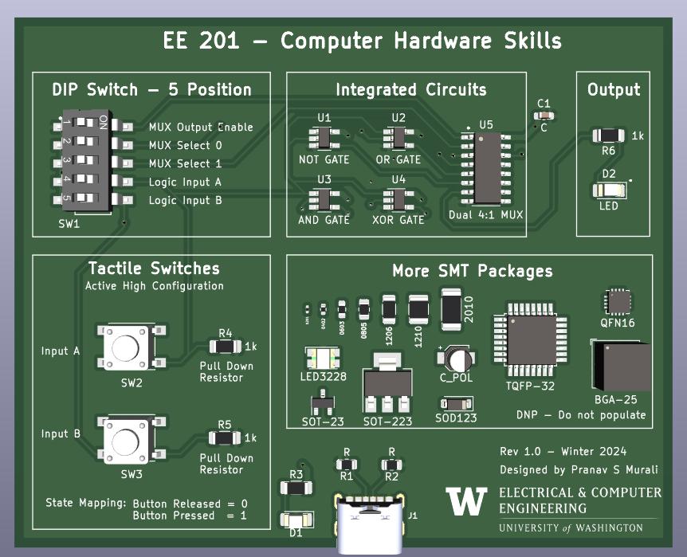

# EE201 - Computer Hardware Skills

## SMD Soldering Practice Board

This PCB was designed with the goal of teaching students how to solder surface mount components. 

### Logic
The core logic of the circuit is the logic gates NOT, AND, OR and XOR. There is a multiplexer the outputs of one of these gates to the LED used for indication.

### Inputs
Power supply for the PCB is through a Type-C USB.

There are two tactile switches (push buttons), used to emulate the inputs A and B for the logic gates. The circuit is in active-high configuration with a weak pull-down resistor of 1k. This value was chosen to consolidate the BOM and limit the number of unique resistors(since LEDs also need current limiting resistors).

A DIP Switch is used to set the MUX configuration of Enable, S0 and S1. The other two inputs of the DIP switch can be used as a back up for inputs A and B.

### More SMT Packages Section

This section is used to provide an overview of some commonly available SMD packages of Passives, Transistors and ICs. Students will not solder this, it is just to give them a feel of how big components are.

### Packages that Students will be Soldering

- Resistors: 0805 and 1206
- LED: 1206
- Logic Gates: SOT323
- MUX: SOIC16
- Capacitor - 0603
- Tactile Switches - 6mmx6mm
- DIP Switch - 2.54mm pitch

### Design Choices

In the process of completing this design, there were several tradeoffs and decisions made. The biggest factor influencing the choices was a circuit of reasonable complexity for Sophomores to solder in approximately 1 hour.

- Logic gates were chosen as the design as it would be intuitive and fun. Some of the other ideas considered were a Digital Dice, Digital Modulator(PPM, PWM, PAM), a device that would indicate a threshold (temperature, etc).
- Limited the number of components to 15
- Limited the package size to 0805

### Possible improvements

- Wanted to interface an RGB Led, but didn't proceed considering cost and complexity of soldering.
- Find a way to control the routing of inputs of the logic gates. Currently there is only routing over the outputs. The logic gates will be draining power unnecessarily.
- Instead of using an off the shelf IC, one of the gates could be replaced with an actual TTL implementation. NOT gate would be the easiest.

### Acknowledgement

This design was inspired by [Educational Logic Gates PCB](https://www.pcbway.com/project/shareproject/Educational_logic_gates_PCB.html)
